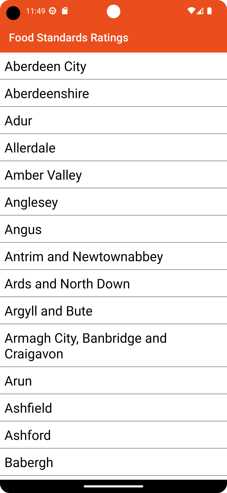

# Infinity Works - Android Tech Test

## Prerequisites

* Android Studio 4.0.1
* Access to the internet

## Getting started

* Set build variant to prodDebug to point app at live food standards agency API
* Set build variant to mockDebug to use test API data
* Build to device or emulator

## Submission

* Please do not fork this repository.
* Please do not commit your code to GitHub.
